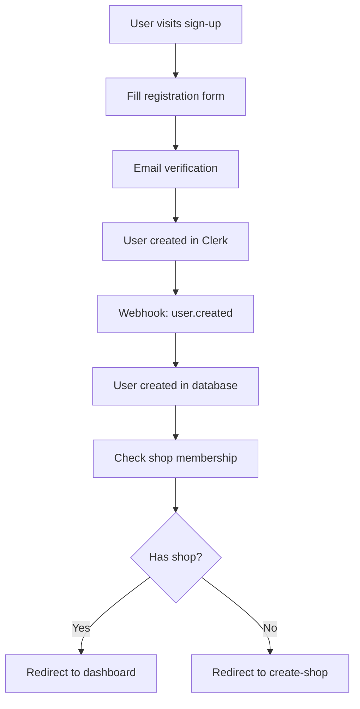
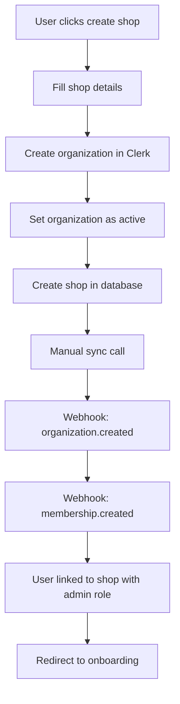
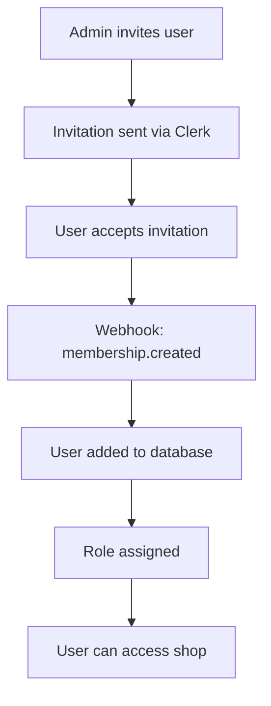

# Comprehensive Auth Process & Clerk-to-Database Synchronization

## Overview

This document outlines the complete authentication and synchronization process between Clerk (authentication provider) and our database (source of truth for business logic). The system ensures seamless data consistency across all user interactions.

## Architecture Principles

### 1. Database as Source of Truth
- **Primary**: Database stores all business-critical data (users, shops, roles, settings)
- **Secondary**: Clerk handles authentication, user sessions, and organization management
- **Sync**: Real-time synchronization ensures data consistency

### 2. Role-Based Access Control (RBAC)
- **Database Roles**: `admin`, `member` (normalized from Clerk's `org:admin`, `org:member`)
- **Permission System**: Hierarchical permissions based on database roles
- **Consistency**: Roles always match between Clerk and database

### 3. Shop-Centric Design
- **Multi-tenant**: Each shop is isolated with its own data
- **Membership**: Users belong to exactly one shop at a time
- **Settings**: Shop-specific configurations and preferences

## Complete Auth Flow

### 1. User Registration Flow



**Key Steps:**
1. **Sign-up Form**: User provides email, name, password
2. **Email Verification**: 6-digit code verification
3. **Clerk Creation**: User account created in Clerk
4. **Webhook Sync**: `user.created` webhook creates user in database
5. **Membership Check**: Determine if user belongs to a shop
6. **Redirect**: Based on shop membership status

### 2. Shop Creation Flow



**Key Steps:**
1. **Shop Form**: User provides shop name, description, type
2. **Clerk Organization**: Organization created in Clerk with same ID
3. **Database Shop**: Shop created in database with default settings
4. **Manual Sync**: Immediate sync to ensure consistency
5. **Webhook Processing**: Organization and membership events processed
6. **Role Assignment**: User gets `org:admin` role automatically

### 3. Team Management Flow



**Key Steps:**
1. **Invitation**: Admin sends invitation through Clerk
2. **Acceptance**: User accepts and creates account
3. **Webhook Sync**: Membership automatically synced to database
4. **Role Assignment**: Role determined by invitation or defaults to `member`

## Synchronization Mechanisms

### 1. Webhook Handlers

**Location**: `src/app/api/webhooks/route.ts`

**Supported Events:**
- `user.created` - Create user in database
- `user.updated` - Update user information
- `user.deleted` - Remove user from database
- `organization.created` - Create shop in database
- `organization.updated` - Update shop information
- `organization.deleted` - Delete shop and handle cleanup
- `organizationMembership.created` - Add user to shop
- `organizationMembership.updated` - Update user role
- `organizationMembership.deleted` - Remove user from shop

**Error Handling:**
- Retry logic for failed operations
- Detailed logging for debugging
- Graceful handling of missing data

### 2. Auth Sync Utility

**Location**: `src/lib/auth-sync.ts`

**Features:**
- **Comprehensive Sync**: Full organization sync from Clerk
- **User Management**: Create, update, and remove users
- **Shop Management**: Create and update shops with settings
- **Membership Management**: Handle user-shop relationships
- **Consistency Verification**: Check and fix data inconsistencies
- **Error Handling**: Robust error handling with detailed reporting

**Key Methods:**
```typescript
// Sync individual user
await authSync.syncUser({ clerkId, email, name, shopId, role })

// Sync shop/organization
await authSync.syncShop({ id, name, slug, description, type })

// Sync user membership
await authSync.syncMembership({ userId, shopId, role, email, name })

// Full organization sync
await authSync.syncOrganizationFromClerk(orgId)

// Verify data consistency
await authSync.verifyConsistency(shopId)
```

### 3. Manual Sync Endpoint

**Location**: `src/app/api/sync-users-with-clerk/route.ts`

**Purpose**: Development tool for manual synchronization
**Features:**
- Full organization sync
- Real-time feedback
- Error reporting
- Development-only access

## Settings Management

### 1. Shop Settings

**Location**: `src/app/dashboard/settings/page.tsx`

**Features:**
- **General Settings**: Timezone, currency, date format
- **Shop Information**: Name, slug, description, type
- **Store Credit**: Enable/disable, limits, amounts
- **Notifications**: Email, SMS, alerts
- **Security**: 2FA, session timeout
- **Advanced**: Debug mode, backups, data export

### 2. Role-Based Access

**Admin Features:**
- View all team members
- Invite new members
- Update member roles
- Remove members
- Sync data manually
- Verify data consistency

**Member Features:**
- View own profile
- Update personal settings
- Access shop features based on permissions

### 3. Data Synchronization

**Real-time Sync:**
- Automatic webhook processing
- Immediate role updates
- Shop membership changes
- Settings propagation

**Manual Sync:**
- Admin-initiated sync
- Consistency verification
- Error reporting and resolution

## Error Handling & Recovery

### 1. Webhook Failures

**Causes:**
- Network issues
- Database constraints
- Invalid data
- Missing dependencies

**Recovery:**
- Retry logic with exponential backoff
- Manual sync endpoint for recovery
- Detailed error logging
- Admin notifications

### 2. Data Inconsistencies

**Detection:**
- Consistency verification tools
- Role mismatch detection
- Orphaned user detection
- Missing shop detection

**Resolution:**
- Automatic fixes where possible
- Manual intervention for complex cases
- Data migration tools
- Rollback capabilities

### 3. User Experience

**Loading States:**
- Skeleton loaders during data fetch
- Progress indicators for sync operations
- Error messages with actionable steps
- Success confirmations

## Security Considerations

### 1. Authentication
- Clerk handles all authentication
- JWT tokens for API access
- Session management
- Multi-factor authentication support

### 2. Authorization
- Database roles as source of truth
- Permission checks on all operations
- Shop isolation
- Admin-only operations protected

### 3. Data Protection
- Encrypted data transmission
- Secure webhook verification
- Input validation
- SQL injection prevention

## Development Tools

### 1. Debug Endpoints

**Available in Development:**
- `/api/sync-users-with-clerk` - Manual sync
- `/api/debug-clerk` - Clerk data inspection
- `/api/debug-database` - Database state inspection
- `/dashboard/debug-roles` - Role debugging interface

### 2. Monitoring

**Logging:**
- Detailed webhook logs
- Sync operation tracking
- Error reporting
- Performance metrics

**Alerts:**
- Failed webhook notifications
- Sync failure alerts
- Data inconsistency warnings
- System health monitoring

## Best Practices

### 1. Development
- Always test webhook flows
- Verify data consistency after changes
- Use manual sync for testing
- Monitor logs for errors

### 2. Production
- Monitor webhook delivery
- Set up alerts for failures
- Regular consistency checks
- Backup critical data

### 3. User Management
- Use proper role assignments
- Test invitation flows
- Verify member permissions
- Handle edge cases gracefully

## Troubleshooting

### Common Issues

1. **User not linked to shop**
   - Check webhook delivery
   - Verify user exists in database
   - Run manual sync
   - Check Clerk organization membership

2. **Role mismatches**
   - Compare Clerk and database roles
   - Run consistency verification
   - Update roles manually if needed
   - Check webhook processing

3. **Shop creation failures**
   - Verify Clerk organization creation
   - Check database constraints
   - Review error logs
   - Retry with manual sync

### Debug Commands

```bash
# Check webhook status
curl -X POST /api/sync-users-with-clerk

# Verify data consistency
# (Use settings page "Verify Data" button)

# Check user roles
# (Use debug-roles page)
```

## Future Enhancements

### 1. Planned Features
- Real-time sync status dashboard
- Advanced role management
- Bulk user operations
- Automated consistency checks
- Enhanced error recovery

### 2. Performance Optimizations
- Batch webhook processing
- Caching strategies
- Database query optimization
- Async operation improvements

### 3. Monitoring Enhancements
- Real-time sync metrics
- Performance dashboards
- Automated alerting
- Health check endpoints

---

This comprehensive auth process ensures seamless synchronization between Clerk and our database, providing a robust foundation for multi-tenant shop management with proper role-based access control and data consistency. 